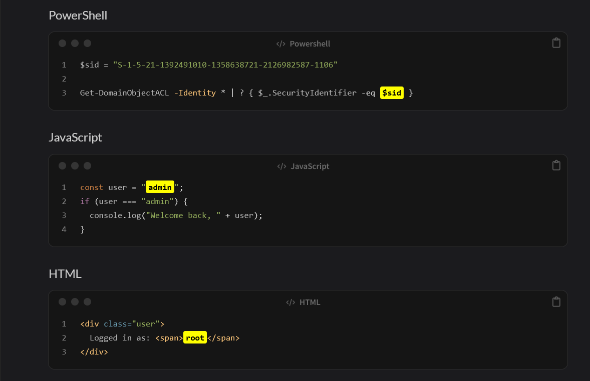

# Jekyll-Chirpy Code Highlighter

The Chirpy theme does not natively support highlighting text inside code blocks.
This plugin, together with a small CSS snippet, adds the ability to highlight specific parts of code.

## Example



## Installation
1. Copy `highlight_code.rb` into your `_plugins` folder.
2. Copy `highlight_code.css` into `/assets/css/highlight_code.css`
3. Update `_layouts/post.html` to include the new stylesheet by appending `<link rel="stylesheet" href="{{ '/assets/css/highlight_code.css' | relative_url }}">` at the end of the file

## Usage
Write your code blocks as usual.
To highlight a portion of text inside them, wrap the text with double equal signs:
```
This is an ==example==
```


## Customization 

You can change the colour of the highlighted code wihin the css file. The simbols used to select the code to highlight the code can also be changed to your liking in the ruby file.
