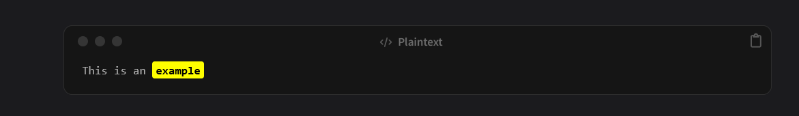

# Code-Highlighter-for-Chirpy-Jekyll-Theme

The Chirpy theme does not natively support highlighting text inside code blocks.
This plugin, together with a small CSS snippet, adds the ability to highlight specific parts of code.

## Example


## Installation
1. Copy highlight_code.rb into your _plugins folder.
2. Copy custom_js.html into your _includes folder.
## Usage
Write your code blocks as usual.
To highlight a portion of text inside them, wrap the text with double equal signs:
```
This is an ==example==
```

